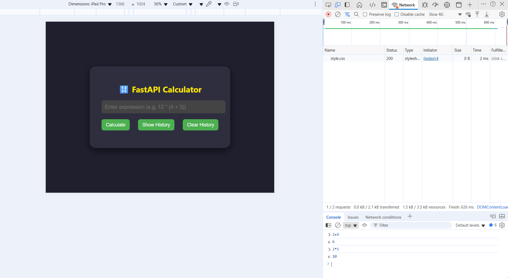

#FASTAPICalculator
# 🔢 FASTAPI Calculator

A simple yet powerful calculator web app built using **FastAPI** for the backend and **HTML/CSS/JavaScript** for the frontend.

---

## 🚀 Features

- Evaluate math expressions like `2+3*5`, `sqrt(16)`, etc.
- FastAPI backend with secure expression handling
- Clean and responsive UI
- Error handling for invalid inputs

---

## 🖥️ Screenshots

### 🧮 Calculator UI


### 🧠 Backend Response



---

## 🛠️ Tech Stack

- **Backend:** FastAPI
- **Frontend:** HTML, CSS, JavaScript
- **Server:** Uvicorn

---

## 📦 Setup & Run Locally

1. **Clone the repo**
   ```bash
   git clone https://github.com/your-username/fastapi-calculator.git
   cd fastapi-calculator
